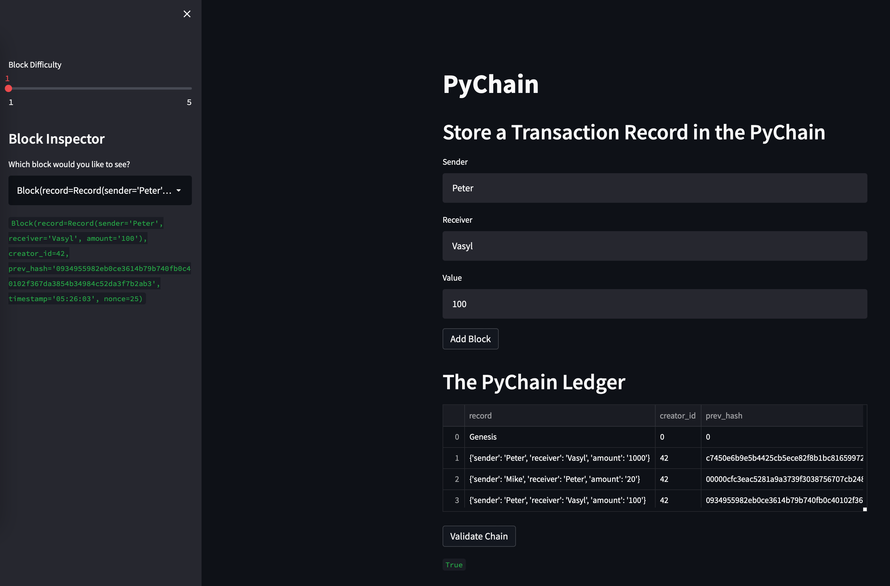

# PyChain Ledger

You’re a fintech engineer who’s working at one of the five largest banks in the world. You were recently promoted to act as the lead developer on their decentralized finance team. Your task is to build a blockchain-based ledger system, complete with a user-friendly web interface. This ledger should allow partner banks to conduct financial transactions (that is, to transfer money between senders and receivers) and to verify the integrity of the data in the ledger.

You’ll make the following updates to the provided Python file for this assignment, which already contains the basic `PyChain` ledger structure that you created throughout the module:

1. We created a new data class named `Record`. This class will serve as the blueprint for the financial transaction records that the blocks of the ledger will store.

---

## Description

### Step 1: Record Data Class

We define a new Python data class named `Record`. This class has the following structure:

1. An attribute named `sender` of type `str`.

2. An attribute named `receiver` of type `str`.

3. An attribute named `amount` of type `float`.

### Step 2: Block Data Class that Stores Record Data

In your `Block` class `record` is set it to use an instance of the `Record` class 

### Step 3: User Inputs added to the Streamlit Interface

We add additional input areas for the user interface of the Streamlit application. 
As part of the “Add Block” button functionality, we set an instance of `Record` that contains the `sender`, `receiver`, and `amount` values.

### Step 4: Test the PyChain Ledger by Storing Records

We our `PyChain` ledger and user interface by running a Streamlit application and storing some mined blocks in the `PyChain` ledger. We test the blockchain validation process by using the `PyChain` ledger. To do so, we complete the following steps:

1. In the terminal, run the Streamlit application by using `streamlit run pychain.py`.

2. We enter values for the sender, receiver, and amount, and then click the Add Block button. We do this several times to store several blocks in the ledger.

3. We verify the block contents and hashes in the Streamlit dropdown menu. We took a screenshot of the Streamlit application page, which details a blockchain that consists of multiple blocks. 

4. We tested the blockchain validation process by using the web interface.

 
---

© 2021 Trilogy Education Services, a 2U, Inc. brand. All Rights Reserved.
